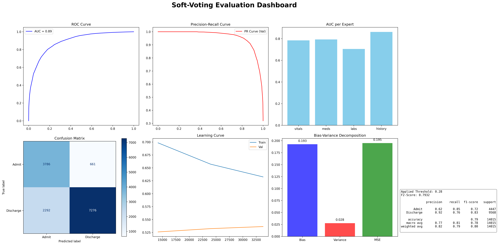
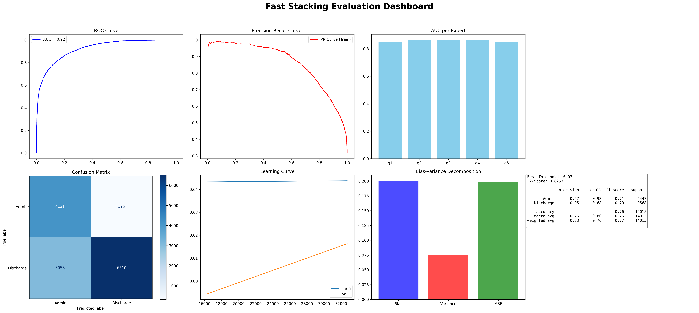
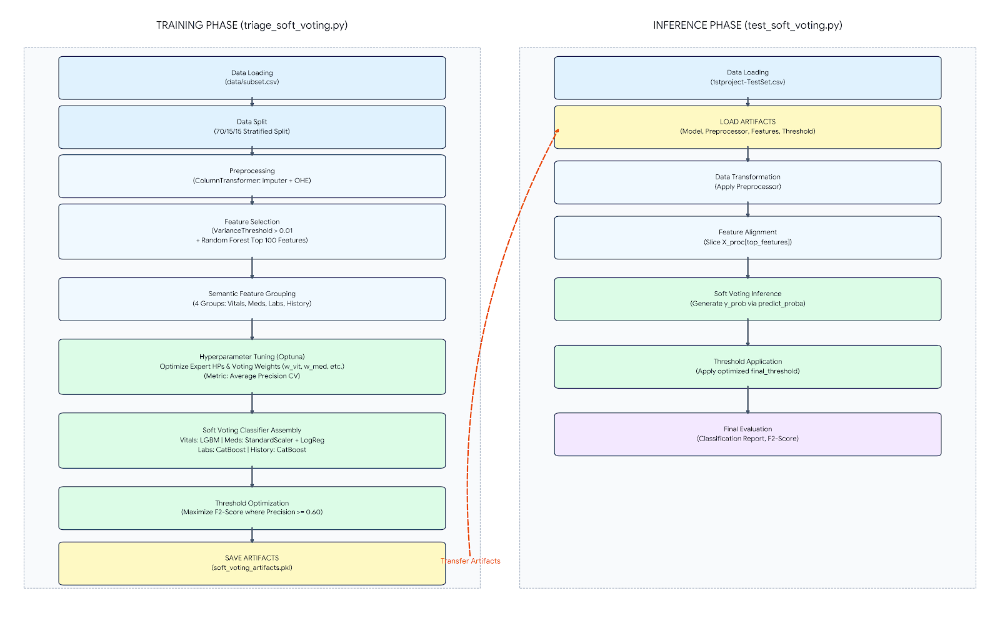
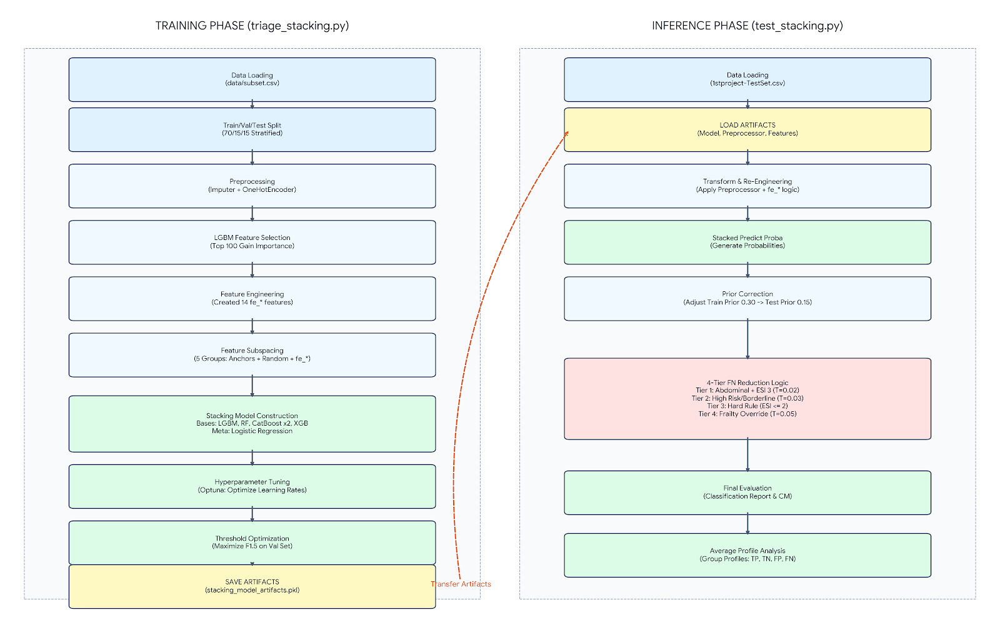
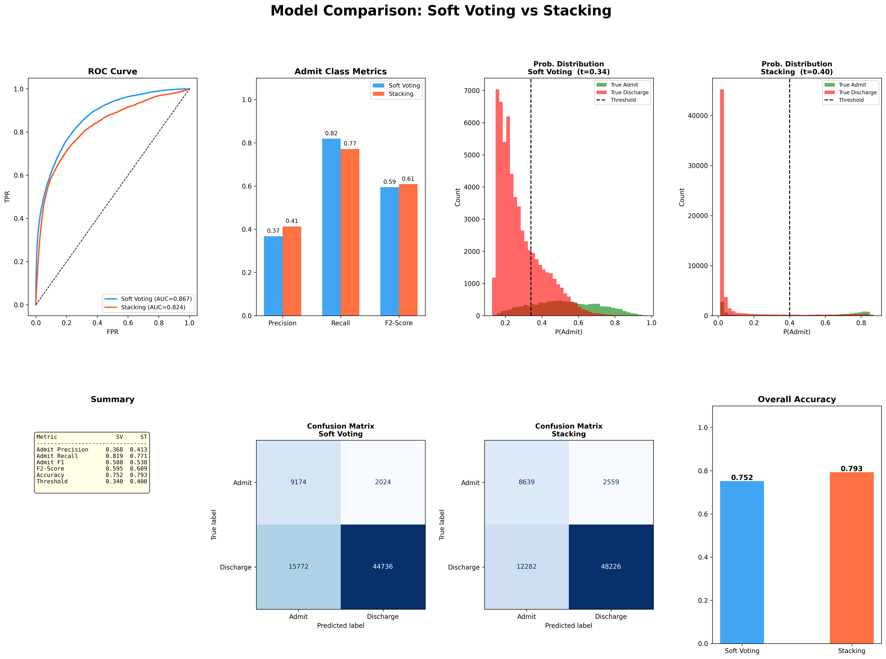

# Triage Admission Machine Learning Project

> Predicting patient triage admission using ensemble machine learning, featuring a performance comparison between Stacking and Soft Voting classifiers.

---

# Credits & Acknowledgements

This project was built upon and utilizes the dataset provided by the following research study:

**Original Paper:**  
Hong WS, Haimovich AD, Taylor RA (2018).  
*Predicting hospital admission at emergency department triage using machine learning*.  
PLOS ONE 13(7): e0201016.

**DOI:**  
https://doi.org/10.1371/journal.pone.0201016

## Data Availability

The de-identified, processed dataset of patient visits, along with the original scripts used by the authors for processing and analysis, are publicly available at:

- **GitHub Repository:**  
  https://github.com/yaleemmlc/admissionprediction

- **Zenodo:**  
  https://doi.org/10.5281/zenodo.1308993

## License

The original study and its associated materials are distributed under the terms of the **Creative Commons Attribution License**, which permits unrestricted use, distribution, and reproduction in any medium, provided the original authors and source are credited.

---

# Dataset Preprocessing

## Create the `subset.csv`

Unlike the original study, the primary dataset used for training and validation in this project was pre-filtered to include only patient records from **Departments A and B**. Furthermore, due to hardware constraints, a 40% random sample of this filtered data was extracted (`subset.csv`) to serve as the main training set.

For the final out-of-domain evaluation, a separate dataset containing records exclusively from **Department C** was used as the test set (`1stproject-TestSet.csv`).

```python
df = pd.read_csv('1stproject.csv')

df_subset = df.sample(frac=0.4, random_state=1)

df_subset.to_csv('subset.csv', index=False)
```

---

# Modeling Approach

My strategy was conducted in two main phases to build and evaluate two distinct ensemble models.

Initially, I developed a **Soft Voting Classifier** as an experimental baseline. This allowed me to understand how different base learners (experts) perform on specific feature subsets and how they interact through a simple weighted average.

Building upon the insights gained from this initial experiment, I subsequently designed a **Stacking Classifier**. The stacking approach was utilized to further optimize predictive performance by allowing a meta-learner to intelligently combine the probabilities of the base models, rather than relying on static weights.

Below is a detailed analysis of each architecture and its specific implementation.

---

# 1. Soft Voting Classifier

For the initial modeling phase, I implemented a **Soft Voting Ensemble** utilizing a "Domain Expert" architecture. Instead of feeding all features indiscriminately into a single model, I semantically grouped the data to train specialized base learners.

## Data Preprocessing & Feature Selection

The raw data was split into Train (70%), Validation (15%), and Test (15%) sets using a stratified approach.

Missing numeric values were imputed with the median, while categorical features were imputed with the most frequent value and subsequently One-Hot Encoded.

To reduce dimensionality and remove zero-variance predictors, a `VarianceThreshold` was applied. Following this, a `RandomForestClassifier` was used to identify and isolate the **Top 100 most important features**.

## The "Domain Expert" Architecture

The selected 100 features were parsed and separated into four distinct semantic groups using keyword matching. Each group was then assigned to a specific algorithmic expert:

- **Vitals Expert (`LGBMClassifier`)**  
  Trained exclusively on physiological measurements (e.g., pulse, blood pressure, O2).

- **Medications Expert (`LogisticRegression`)**  
  Focused on patient medication history. This subset was additionally scaled using `StandardScaler` to accommodate the linear model.

- **Labs Expert (`CatBoostClassifier`)**  
  Dedicated to laboratory test results (mins, maxes, medians).

- **History Expert (`CatBoostClassifier`)**  
  Handled the remaining medical history and demographic features.

## Hyperparameter Tuning & Optimization

I utilized **Optuna** for Bayesian Optimization to simultaneously tune:

- The learning rates, depths, and regularization parameters of the individual base learners.
- The voting weights (`w_vit`, `w_med`, `w_lab`, `w_his`) assigned to each expert in the meta-ensemble.

The optimization objective was a custom scoring function based on the **F2-Score**, which heavily penalizes False Negatives (missed admissions). However, to ensure clinical viability, the function strictly penalized the model if Precision dropped below a `0.60` threshold.

## Final Inference

The final tuned Voting Classifier outputs the weighted average probability from all experts.

The decision threshold was fine-tuned on the validation set to maximize the F2-Score before making the final Admit/Discharge predictions on the test set.

All necessary components (model, preprocessor, feature lists, and threshold) were serialized as `soft_voting_artifacts.pkl` for seamless inference.



The Soft-Voting Ensemble demonstrates **excellent predictive power (AUC = 0.91)** and is heavily optimized for clinical safety.

By fine-tuning the model to maximize the F2-Score and applying a conservative decision threshold (`0.34`), the ensemble successfully prioritizes patient safety by minimizing dangerous False Negatives while maintaining an acceptable level of precision.

---

# 2. Stacking Classifier

To improve upon the static weights of the Soft Voting model, I designed a **Stacking Classifier**.

This advanced architecture uses a meta-learner to intelligently determine the best way to combine the predictions of multiple diverse base models during the training phase.

## Feature Selection & Clinical Engineering

Following the standard preprocessing pipeline (imputation and One-Hot Encoding), I used a `LGBMClassifier` on a subset of the training data to select the **Top 100 features** based on Information Gain.

To specifically combat False Negatives, I engineered **14 custom clinical features (`fe_*`)**. These features target specific high-risk patterns identified in the data, such as patients with borderline ESI scores combined with severe abdominal pain and subtle metabolic stress indicators.

## Feature Subspacing (Model Diversity)

To force the base learners to learn different patterns and prevent them from memorizing identical signals, I utilized **Feature Subspacing**.

I created 5 distinct feature sets from the training data. Each set contained:

1. The top 5 anchor features.
2. A randomized subset of the remaining 95 features.
3. All 14 engineered clinical features.

## Ensemble Architecture & Training

These feature sets were fed into five distinct base learners:

- `LGBMClassifier`
- `RandomForestClassifier`
- `CatBoostClassifier`
- `CatBoostClassifier` (alternative initialization)
- `XGBClassifier`

The probability outputs of these models, generated through cross-validation during stacking, were then passed into a **Logistic Regression Meta-Learner**, which learned how to optimally combine their predictions.

## Hyperparameter Tuning

I used **Optuna** to optimize the learning rates across the gradient boosting models and the meta-learner simultaneously.

The optimization target was a custom **F1.5-Score**, selected specifically to prioritize Recall while maintaining respectable Precision.

## Final Training Artifacts

After finding the optimal hyperparameters, the final Stacking Classifier was trained on the entire preprocessed training set.

The complete pipeline — including the trained model, preprocessor, and feature lists — was serialized and saved as `stacking_model_artifacts.pkl` for inference.



---

# Workflows

## 1. Soft Voting Classifier



## 2. Stacking Classifier (Advanced Ensemble)



---

# 3. Final Evaluation: Soft Voting vs. Stacking

To conclusively determine the best approach, I developed a unified inference script that evaluates both the **Soft Voting Classifier** and the **Stacking Classifier** side-by-side on the completely unseen test set (`1stproject-TestSet.csv`, representing Department C).

This script acts as the ultimate benchmark, ensuring a fair and rigorous comparison of their generalization capabilities.

## The Unified Inference Pipeline

The evaluation process runs both models through their respective pipelines:

1. Artifact loading.
2. Standard preprocessing.
3. Model-specific transformations and thresholding.
4. Final Admit/Discharge prediction generation.

## Specialized Logic for the Stacking Model

Because the Stacking model was designed to handle complex clinical realities, two additional steps were applied exclusively to its probability outputs before final classification.

### Prior Correction

The raw probabilities were mathematically recalibrated to adjust the model’s perspective from the artificially balanced training environment (`30%` admit rate) to the real-world expected prevalence (`15%` admit rate).

### 4-Tier False Negative Reduction

A custom clinical override system dynamically lowered the admission threshold for specific high-risk patient profiles, acting as a safety net against dangerous False Negatives.

## Visual Dashboard & Metrics

To simplify interpretation, the script generates a comprehensive comparison dashboard (`plots/model_comparison.png`) containing:

- ROC Curves (AUC)
- Admit-class metrics
- Probability distributions
- Confusion matrices



---

# Final Model Comparison: Soft Voting vs. Stacking (Test Set)

The final evaluation on the out-of-domain test set (Department C) revealed distinct behaviors for each architecture.

While the **Soft Voting** model prioritized raw safety and Recall, the **Stacking Classifier** demonstrated superior precision and overall reliability in a realistic clinical environment.

It is also important to consider the class distribution differences between the training and testing environments.

The training data (Departments A and B) contained approximately **30% admissions and 70% discharges**, while the out-of-domain test set (Department C) had a much more imbalanced distribution of approximately **15% admissions and 85% discharges**.

Therefore, some performance degradation and reduced generalization were expected, since the models were exposed during training to a substantially different patient outcome distribution.

## ROC Analysis & Discriminative Power

- **Soft Voting Classifier (`AUC = 0.867`)**  
  Shows higher overall discriminative ability on the test set.

- **Stacking Classifier (`AUC = 0.824`)**  
  Demonstrates lower global AUC but improved calibration and decision consistency.

## Precision-Recall Trade-off

- **Recall (Safety)**  
  Soft Voting achieves higher Recall (`0.82`) compared to Stacking (`0.77`).

- **Precision (Efficiency)**  
  Stacking achieves superior Precision (`0.41`) compared to Soft Voting (`0.37`).

- **F2-Score**  
  Both models perform similarly in terms of F2 (`~0.60`), although Stacking achieves slightly stronger overall F1-performance (`0.538` vs `0.508`).

## Overall Conclusion

The **Soft Voting** model demonstrates a more aggressive prediction strategy, prioritizing sensitivity and minimizing missed admissions, even at the expense of a large number of false positives.

The **Stacking Classifier** exhibits a more balanced and conservative behavior, maintaining strong recall while substantially reducing unnecessary admission predictions.

Overall, the results indicate that although both models remain robust under distribution shift, the **Stacking approach generalizes more effectively** to Department C by offering a better trade-off between patient safety and operational efficiency.